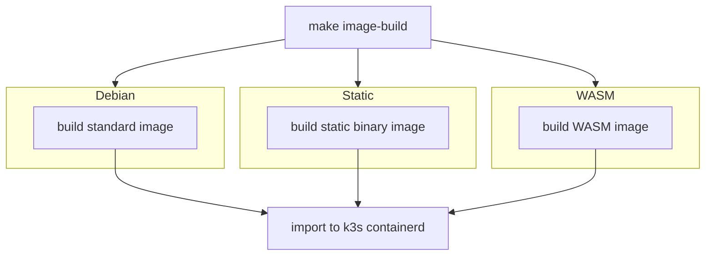
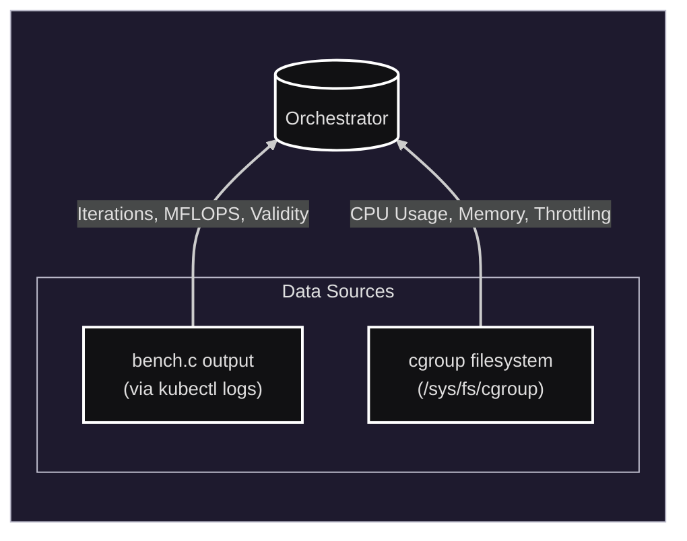

# KRATER
## Kubernetes Runtime Analysis Tool for Empirical Research


## Overview

A benchmarking framework for empirical comparison of WebAssembly and Linux container runtime environments in K3s, using cgroup-based resource monitoring and configurable compute workloads. 

## Project Structure

* Source code (`src/`):

    * **bench.c**: Benchmark source. Performs matrix multiplication with integrated validity check. Outputs iterations and throughput in MFLOPS.

    * **single_env_bench.py**: A Python orchestrator that handles pod deployment, log parsing, and cgroup resource monitoring for a single execution environment.

    * **metaorchestrator.py**: The main benchmarking script. Coordinates a benchmark suite across multiple execution environments. It is configured exclusively by `bench_config.yaml`.

    * **bench_config.yaml**: Single source of truth for benchmark configuration - environments, matrix sizes, trial count, duration, warmup, cgroup sample interval, and output subfolder.

* **Dockerfile**: Multi-stage build file defining three targets:
    * `debian`: Standard GCC build (Debian Slim)
    * `static`: Statically linked binary (Scratch)
    * `wasm`: WebAssembly build using WASI SDK (Scratch).

* **Makefile**: Manages the full project lifecycle - dependency checking, WASM shim setup, image building, running the benchmark suite, and cleanup.


## Prerequisites

- Linux with root access (required for `/sys/fs/cgroup`)
- [K3s](https://k3s.io/) with containerd
- Docker (BuildKit enabled)
- `kubectl` configured for K3s (`KUBECONFIG=/etc/rancher/k3s/k3s.yaml`)
- Python 3 with `pyyaml` (`pip install pyyaml`)
- [KWasm Operator](https://kwasm.sh/) (for WASM targets)

## Installation & Setup

### 1. Verify dependencies

```bash
make check-deps
```

### 2. Set up WASM support (WASM targets only)

Install the KWasm operator via Helm:

```bash
helm repo add kwasm http://kwasm.sh/kwasm-operator/
helm install -n kwasm --create-namespace kwasm-operator kwasm/kwasm-operator
```

Annotate the node to trigger shim binary installation (replace `<node-name>` with your node):

```bash
kubectl annotate node <node-name> kwasm.sh/kwasm-node=true
```

Wait for the installer pod to complete, then create the required symlinks:

```bash
make setup-wasm
```

### 3. Build and import images

```bash
make image-build
```


Creates `krater-debian:latest`, `krater-static:latest`, `krater-wasm:latest` and imports them into the K3s containerd registry.

### Cleanup

- `make reset` - remove project images from Docker and K3s
- `make hard-reset` - also removes build tools pulled by Docker during the build

## Usage

```bash
make run
```

*Root privileges are required to read from `/sys/fs/cgroup`.*

The `metaorchestrator.py` script automates the benchmarking process across many environments by executing `single_env_bench.py` for each image in `bench_config.yaml`, using the shared arguments defined below them.

These are the pre-defined parameters of the benchmark suite:


```
environments:
  - image: krater-debian:latest
    runtime_class: default

  - image: krater-static:latest
    runtime_class: default

  - image: krater-wasm:latest
    runtime_class: wasmtime

  - image: krater-wasm:latest
    runtime_class: wasmedge

  - image: krater-wasm:latest
    runtime_class: wasmer


shared_args:
  sizes: [256, 1024]
  trials: 25
  duration: 30
  warmup: true
  interval: 0.5
  namespace: default
  cpu: "1000m"
  memory: "1024Mi"
  results_subfolder_name: test_bench
```

## Output Results



The results are saved under `results/<subfolder>/` (where `<subfolder>` is `results_subfolder_name` from the config), with one `.json` file per execution environment. Each entry is keyed as `<size>_w` (with warmup) or `<size>_nw` (without warmup) and contains:

### 1. Phases (Timestamps)

Lifecycle events, recorded as Unix timestamps:

* `start`: Deployment trigger time
* `running_time`: Pod reached `Running` state
* `bench_start`: The moment the C application prints `BENCH_START` (after optional warmup).
* `end`: The moment the C application prints `BENCH_END`.


### 2. Parsed Metrics (C Application Log)

Metrics extracted directly from the C application's standard output:

* `iterations`: Total matrix multiplications completed.
* `throughput_mflops`: Speed in MFLOPS.
* `valid`: `true` if calculation check passed.

### 3. Samples (Time Series)

A list of raw snapshots captured from `/sys/fs/cgroup` at the defined `--interval`. Each sample object contains:

* `timestamp`: Time of the snapshot.
* `usage_usec`: Total CPU time consumed in microseconds.
* `user_usec`: CPU time spent in user space.
* `system_usec`: CPU time spent in kernel space.
* `nr_throttled`: Cumulative count of throttle events.
* `mem_bytes`: Total memory usage (RSS + Cache).
* `rss_bytes`: Resident Set Size.

### 4. Additional Metrics (Computed)

Derived from processing the raw cgroup samples:

* `cold_start_time`: Startup latency (`running_time` - `start`).
* `avg_cpu_cores`: Average CPU usage normalized to cores (e.g., 1.0 = 1.0 cores used).
* `peak_mem_bytes`: The highest memory usage observed during the trial.
* `avg_mem_bytes`: The average memory usage throughout the execution.
* `throttled_events`: The total number of times the CPU was throttled by the cgroup controller.
