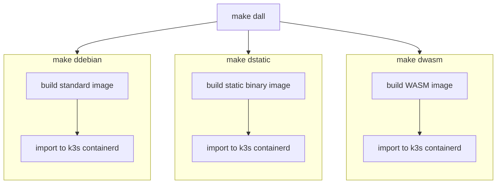
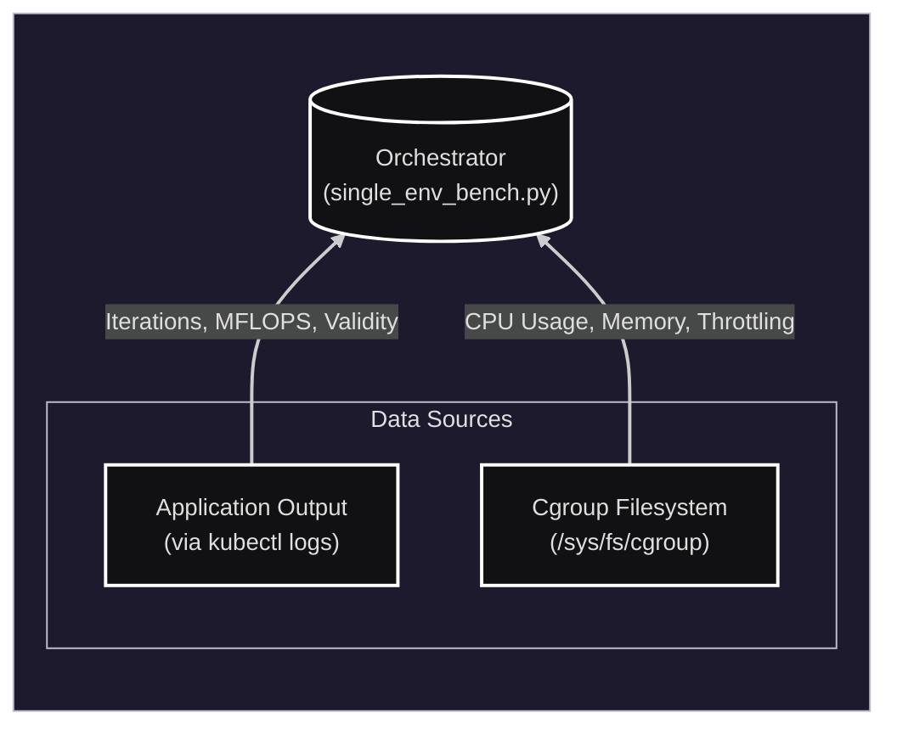

# Matrix Multiplication Benchmark

## Overview

A benchmark comparing floating-point performance and resource efficiency across different container runtimes (standard Linux, static binary, WebAssembly). 

## Project Structure

* **mmb.c**: Benchmark source. Performs matrix multiplication with integrated validity check. Outputs iterations and throughput in MFLOPS.

* **Dockerfile**: Multi-stage build file defining three targets:
    * `debian`: Standard GCC build (Debian Slim)
    * `static`: Statically linked binary (Scratch)
    * `wasm`: WebAssembly build using WASI SDK (Scratch).

* **Makefile**: Automates building the Docker images and importing them directly into the K3s containerd registry.

* **single_env_bench.py**: A Python orchestrator that handles Pod deployment, log parsing, and cgroup resource monitoring.


## Prerequisites

* OS: Linux (root required for /sys/fs/cgroup access).
* Cluster: K3s (Makefile targets k3s ctr).
* Tools: Docker, kubectl, Python 3 (pyyaml required).
* Wasm: KWasm Operator or equivalent shims for mmb-wasm.

## Installation & Setup

1. **Build and Import Images**:
Use the Makefile to build all Docker container images and import them into the K3s registry.
```bash
make dall
```


Creates `mmb-debian:latest`, `mmb-static:latest`, `mmb-wasm:latest`


2. **Clean Up**:
* To remove images from Docker: `make dclean`
* To delete *all* pods: `make kclean`

## Usage
The `single_env_bench.py` script automates the benchmarking process.

**Note:** Root privileges (sudo) are required to read from `/sys/fs/cgroup`.

### Syntax

```bash
sudo python3 single_env_bench.py --image <IMAGE> --runtime_class <CLASS> [OPTIONS]
```

### Arguments

* `--image` (Required): Docker image tag (e.g., `mmb-debian:latest`).
* `--runtime_class` (Required): Kubernetes RuntimeClass (e.g. `wasmedge`, `wasmtime`). Write `default` for non-WASM container images.
* `--ns`: Kubernetes namespace to deploy into (default: `default`).
* `--output`: Output JSON filename (default: `bench_results.json`).
* `--sizes`: Space-separated list of matrix dimensions  (default: `512 1024`).
* `--trials`: Number of repeated trials per matrix size (default: `5`).
* `--duration`: Minimum execution time per trial in seconds (default: `10.0`).
* `--warmup`: Flag to enable a 5-second warmup phase before each trial measurement starts.

### Example

Run the Debian image using the default runtime, testing matrix sizes 1024 and 2048 with warmup enabled:

```bash
sudo python3 single_env_bench.py \
  --image mmb-debian:latest \
  --runtime_class default \
  --sizes 1024 2048 \
  --warmup \
  --output debian_results.json

```

## Output Results



Results are saved to JSON. Each entry (`<size>_<mode>`) contains:

### 1. Phases (Timestamps)

Lifecycle events, recorded as Unix timestamps:

* `start`: Deployment trigger time
* `running_time`: Pod reached `Running` state
* `bench_start`: The moment the C application prints `BENCH_START` (after optional warmup).
* `end`: The moment the C application prints `BENCH_END`.

```mermaid
---
config:
  theme: mc
---
gantt
    title Trial execution flow
    dateFormat X
    axisFormat %

    section Orchestrator
    apply & wait                 :orch1, 0, 2
    logs streaming               :orch3, after orch1, 7s
    cgroup monitor thread active :crit, orch4, after ben2, 4s
    save / cleanup               :orch5, after ben4, 1s

    section Pod Status
    ContainerCreating            :pod1, 0, 2
    Running                      :pod2, after pod1, 7s
    Terminating                  :pod3, after pod2, 1s
    
    section App (mmb.c)
    init                         :ben1, after pod1, 1s
    warmup (5s)                  :ben2, after ben1, 1s
    workload loop                :crit, ben3, after ben2, 4s
    validation & exit            :ben4, after ben3, 1s

    section Timestamps
    start                        :milestone, m0, 0, 0s
    running_time                 :milestone, m1, after pod1, 0s
    bench_start                  :milestone, m2, after ben2, 0s
    ‎ end                 :milestone, m3, after ben3, 0s
```



### 2. Parsed Metrics (Application Log)

Metrics extracted directly from the application's standard output:

* `iterations`: Total matrix multiplications completed.
* `throughput_mflops`: Speed in MFLOPS.
* `valid`: `true` if calculation check passed.

### 3. Samples (Time Series)

A list of raw snapshots captured from `/sys/fs/cgroup` at the defined `--interval`. Each sample object contains:

* `timestamp`: Time of the snapshot.
* `usage_usec`: Total CPU time consumed in microseconds.
* `user_usec`: CPU time spent in user space.
* `system_usec`: CPU time spent in kernel space.
* `nr_throttled`: Cumulative count of throttle events.
* `mem_bytes`: Total memory usage (RSS + Cache).
* `rss_bytes`: Resident Set Size.

### 4. Additional Metrics (Computed)

Derived from processing the raw cgroup samples:

* `cold_start_time`: Startup latency (`running_time` - `start`).
* `avg_cpu_cores`: Average CPU usage normalized to cores (e.g., 1.0 = 1.0 cores used).
* `peak_mem_bytes`: The highest memory usage observed during the trial.
* `avg_mem_bytes`: The average memory usage throughout the execution.
* `throttled_events`: The total number of times the CPU was throttled by the cgroup controller.